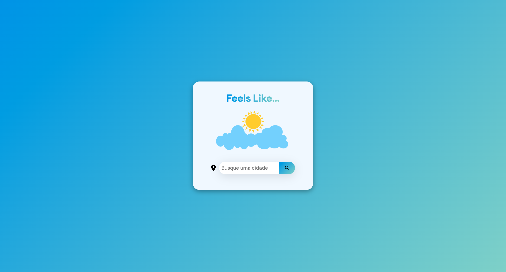
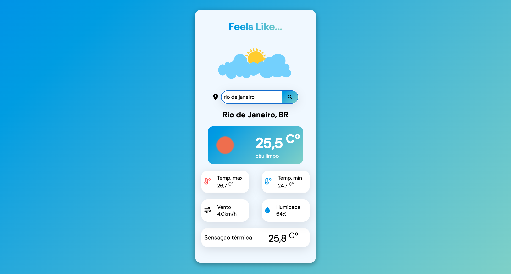

# Feels Like
## Table of contents
  - [The Website](#The-Website)
  - [Screenshots](#screenshots)
  - [Functionalities](#Functionalities)
  - [Built with](#built-with)
  - [Link](#Link)
  - [Author](#author)
  
### The Website
A responsive weather forecast website. 

### Screenshots

### Functionalities
In an animated menu, users can search for a city by name and view weather information including maximum temperature, minimum temperature, wind speed, humidity, and “feels like” temperature.

### Tools
The website was built primarily with vanilla JavaScript, HTML, and CSS. Weather data is retrieved using the OpenWeather API. Styling was done entirely with CSS, including the design and a responsive mobile layout achieved through media queries.

### Built with
- HTML 5
- CSS 3
- Javascript
- JSON
- API
- Git/GitHub

### Link
https://weather-ml8ist2sn-rafaels-projects-3b81a1b9.vercel.app

### Author
Rafael Gevú

# Feels Like
## Tabela de Conteúdos
 - [O Site](#O-site)
 - [Capturas de Tela](#Capturas-de-tela)
 - [Funcionalidades](#functionalidades)
 - [Desenvolvido com](#Desenvolvido-com)
 - [Link](#Link)
 - [Autor](#Link)

### O Site
Um site responsivo que recomenda filmes para o usuário com base no seu humor.

### Capturas de tela

### Funcionalidades
Em um menu animado, os usuários podem pesquisar o nome de uma cidade e visualizar informações climáticas, incluindo temperatura máxima, temperatura mínima, velocidade do vento, umidade e sensação térmica.

### Ferramentas
O site foi desenvolvido principalmente com JavaScript puro (vanilla), HTML e CSS. Os dados climáticos são obtidos através da API do OpenWeather. A estilização foi feita inteiramente com CSS, incluindo o design e a versão responsiva para dispositivos móveis, utilizando media queries.

### Desenvolvido com

- HTML 5
- CSS 3
- Javascript
- JSON
- API
- Git/GitHub

### Link
https://weather-ml8ist2sn-rafaels-projects-3b81a1b9.vercel.app

### Autor
Rafael Gevu